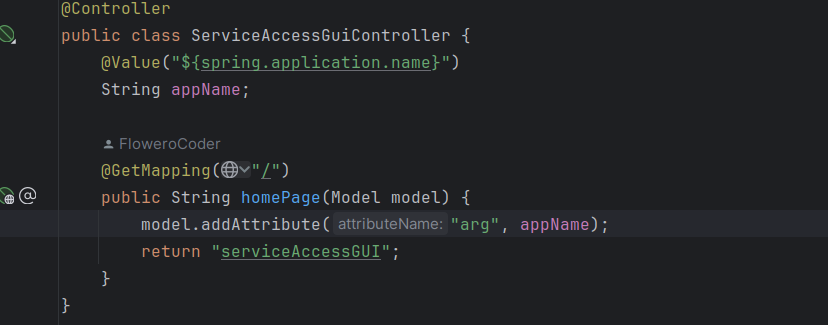
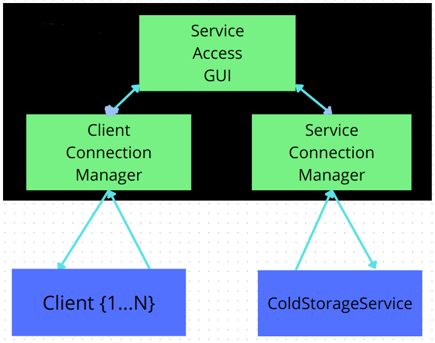
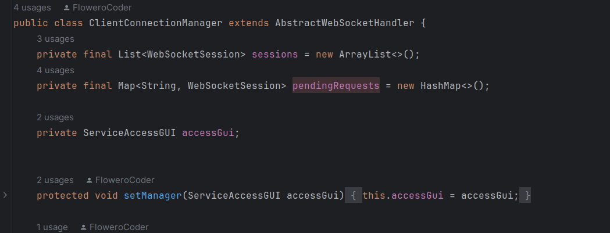
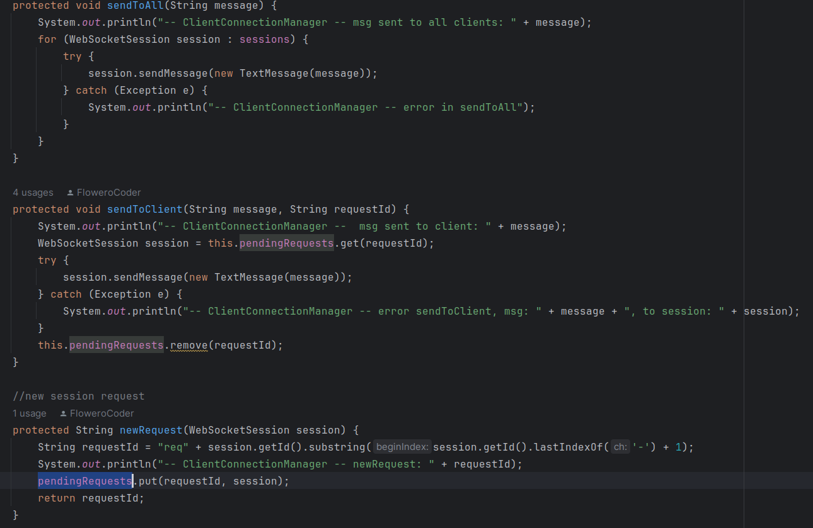
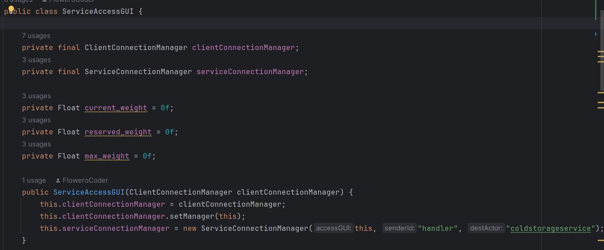
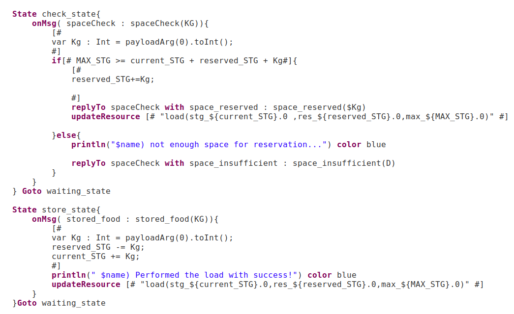
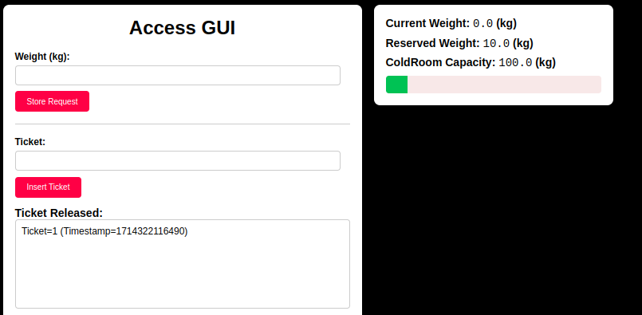
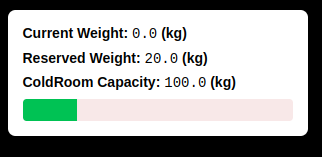
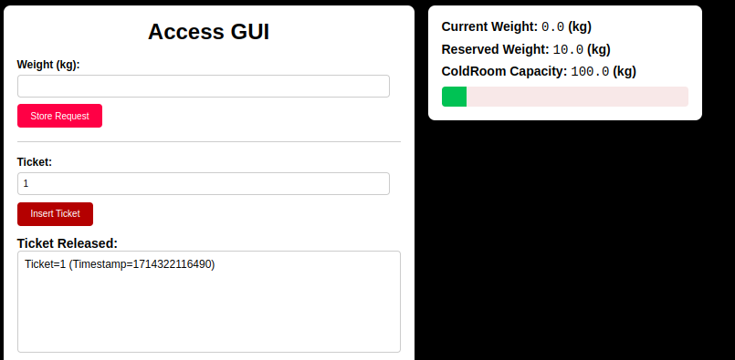
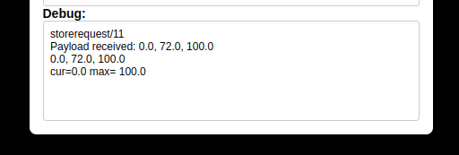

#  Sprint2 
## Obiettivo 
Il presente sprint si propone di approfondire il tema dell'osservabilità su ambiente distribuito, implementandolo per la realizzazione di una Graphical User Interface al sistema ColdStorage. 

## Analisi dei requisiti 
A puro scopo informativo si ripresentano i requisiti di interesse dello Sprint2, in particolare:
La ServiceAccessGUI è protagonista, e da requisito si richiede esplicitamente che questa si comporti come un pannello da cui un utente umano possa immettere un peso per richiedere un ticket. Successivamente, se questo è stato accettato, si inserirà il codice identificativo del ticket per innescare il deposito (scenario di arrivo di un truck all' INDOOR). Inoltre, la GUI deve presentare all'utente una visione aggiornata dello stato di occupazione della ColdRoom.
L'analisi ha prodotto una semplice valutazione: Nel modello embrionale del sistema, un simile comportamento è attivo, deve interagire col sistema mediante scambio di messaggi e pertanto viene modellato come un attore.

Il confronto con il committente ha inoltre sollevato un ulteriore requisito: l'interfaccia presentata a ciascun utente deve essere unica e comune.

## Analisi del problema 

Viene discusso, in sede di analisi, la necessità di distribuire il sistema su nodi fisici distinti. Fino a questo momento, la GUI veniva simulata in locale con l'unità di Testing J-Unit, per svolgere le principali funzionalità (richiesta ticket, richiesta di scarico e osservazione di Eventi secondo pattern Observer), in **contesto locale**. Tuttavia, questo pone seri vincoli alla mobilità dei Truck Drivers che per richiedere i ticket dovrebbero già trovarsi in sede del sistema Cold Storage Service. Questo ha portato al confronto di diverse soluzioni, volte a garantire una ottima versatilità nell'interazione con molteplici dispositivi mobili e allo stesso tempo nell'interazione con il sistema. Si è dunque pensato all'ideazione di un Server Web come nodo intermedio che ha lo scopo di gestire le interazioni tra Client (utente) e Cold Storage Service. 
Un server Web offre i vantaggi di:
- Accessibilità via rete su un'enorme platea di dispositivi utilizzando un comune browser.
- Gestione sincrona o asincrona dei messaggi lato client mediante HTTP o WebSocket
- Flessibilità nella gestione delle comunicazioni secondarie col Cold Storage agente da Backend mediante altri protocolli applicativi (esempio: Coap/ MQTT), già testati e funzionanti per la comunicazione con Il Service.
- Permette di concentrarsi solamente sulla presentazione all'utente, con una Manutenzione minima e un deployment leggero e centralizzato.

## Progettazione 

In sede di progettazione, le tecnologie discusse mirano a ridurre i costi e tempi di sviluppo, scegliendo miratamente framework Java-based. Queste sono essenzialmente due: TomCat e SpringBoot. Si è deciso di optare per quest'ultimo in quanto framework semplificato per lo sviluppo e configurazione gestita in automatico e basata sul pattern MVC. Vengono seguiti i dettami del principio di inversione delle dipendenze per garantire l'indipendenza degli strati di livello superiore rispetto a quelli di livello più basso mentre la gestione delle dipendenze viene affidata comunemente a Gradle.

Nello sviluppo di una siffatta applicazione, SpringBoot dispone al **Controller** la possibilità di impostare metadati utili all'esecuzione mediante le **Java annotations**, in particolare i mapping utili per l'elaborazione di una Get HTTP lato client. Trattandosi di una pagina semplice, abbiamo gestito solo il mapping root `"/"` , risultando in:

 

All'avviamento, il framework predispone la configurazione del server in maniera automatica, fissando come porta 8086 per la connessione(`/resources/application.properties`).
Riferendo il Model, Questo viene organizzato secondo un'architettura gerarchica triangolare:

Le tre componenti nei riquadri verdi consistono in classi Java (POJO) definite dallo sviluppatore all'interno del framework Spring (riquadro nero). Le ragioni di una simile architettura sono da ricercare nei dettami del principio di singola responsabilità per svincolare il più possibile la funzioni di connesione ("Client Connection Manager" verso i **client intesi come browser** "Service connection manager" verso il ColdStorageService, attivato su contesto potenzialmente remoto) dall'effettivo **Core Business** del server, inteso come logica attesa di inoltro dei messaggi, ricezione e formattazione del payload.

In ordine:
- Il Browser si connette al Client Connection Manager richiedendo la pagina HTTP associata all'url `"/"`. 
- Il Client (browser) riceve la pagina HTTP che presenta il necessario per inserire i valori interi di ticket e e peso (Input text) e i bottoni per innescare l'invio da parte del sorgente "main.js".
- Alla pressione del bottone, una WebSocket inoltra i messaggi al ClientConnectionManager, che lo gestisce, preprocessa ed inoltra al Service Access Gui per la valutazione ( rappresenta quest'ultimo il Core Business).
- Il Service Connection Manager riceve poi il messaggio e a seconda della richiesta, fabbrica un messaggio apposito per l'inoltro al ColdStorageService. La connessione è in questo caso di tipo CoapConnection() e poggia sul TCP.
- Il processo viene effettuato in retroazione per propagare la risposta fino al Client.

### Client Connection Manager
Componente "passivo" rappresentato da un POJO e realizzato come classe JAVA. Ha il solo scopo di gestire coi suoi metodi le connessioni verso Client esterni. Estende la classe `AbstractWebSocketHandler`, richiesta esplicitamente dal framework per realizzare la comunicazione mediante WebSocket. 

Si identifica il problema dell'associazione: In ogni momento il Client Manager deve tenere traccia di tutti i client collegati (Una comune Lista java) con i token di sessione e, in aggiunta di coloro i quali, tra i client, hanno inviato una richiesta e attendono risposta. In questo secondo caso, l'associazione è fatta tra una stringa (contenente la tipologia di messaggio, e.g. "request", concatenato ad un identificativo) e l'id di sessione, mediante HashMap.

Si definiscono inoltre i metodi "custom":

per l'inoltro alla SAGui, o per l'inserimento di una request nell'HashMap.

### Service Access GUI

Componente per il coordinamento ad alto livello. Il principio dell'inversione delle dipendenze porta alla delegazione della maggior parte delle operazioni ai due POJO (Client e Service Connection Manager), di cui la GUI è essa stessa un POJO tramite i loro attributi private di classe. Viene pertanto acceduta da questi mediante metodi definiti **public**.

I metodi definiti per la classe sono:
- **public void gotReqFromClient(String msg, String requestId)**: a seconda che il messaggio sia una `storerequest` o `dischargefood` innesca due gestioni differenziate del Service Manager sottostante.
- **public void gotRespFromCSS(String msg, String requestId)**: è di contro il metodo con cui si gestiscono le risposte o i dispatch del Service. (In caso di dispatch, l'id di sessione è **Null**) e delega una risposta differenziata per casi al Client Manager sottostante.
- **public String getValue(String msg)**: serve ad estrarre il payload dei messaggi tramite pattern matching.
- **private void updateCount(String data)**: serve ad estrarre i parametri di stato dal payload dei dispatch tramite pattern matching.

### Service Connection Manager
Si tratta del componente speculare al Client Connection Manager. Gestisce l' interazione col solo Cold Storage Service, mediante due modalità definite dal costruttore:
- Viene attivata una connessione TCP verso il ColdStorage (porta 8055), con cui effettuare gli scambi request - response
- Viene attivata una CoapConnection verso la stessa porta con un Handler customizzato, mediante la ridefinizione dei metodi "onError" e "onLoad" innescati dal listener della connessione all'arrivo di un dispatch.

Ulteriori metodi vengono definiti per differenziare il comportamento all'arrivo di una `storerequest` o `dischargefood` ed effettivamente inoltrare e ricevere sulla socket TCP una request-response (metodo **private sendToCSS**).
Vale la pena notare che il pattern implementato è il pattern observer, per il quale gli attori del metamodello qak (interazione Coap-based) offrono già API specifiche per l'aggiornamento degli osservatori.

E' nostro interesse osservare gli aggiornamenti da parte del ColdRoom sullo stato in tempo reale di peso, spazio riservato e Max storage.
Lato Cold Storage Service, sarà sufficiente apportare una modifica mediante il tag `UpdateResource` nell'attore ColdRoom.

### Testing
E' stato realizzato un piano di test per verificare la corretta interazione tra:
- ClientConnectionManager e AccessGUI
- AccessGUI e ServiceConnectionManager
a fronte di differenti scenari di utilizzo e condizioni di input per garantire che il sistema si comporti come previsto.
In particolare:
1. **test_dischargefood_ok**: Simulazione richiesta di storage `storerequest` seguita da una richiesta `dischargefood` con inserimento del ticket con il numero ricevuto entro i tempi limite.

3. **test_dischargefood_ko**: Comportamento del sistema quando viene fornito un ticket non valido per la richiesta di scarico di cibo. In questo caso, viene inserito un ticket number mai rilasciato.

4. **test_storerequest_ok**: Gestione di una  `storerequest`  con restituzione di ticket valido. 

5. **test_storerequest_ko**: Simulazione di  `storerequest`  e di una `dischargefood` con il ticket number ricevuto dopo la sua scadenza. 

6. **test_coda_tickets**: Invio di più richieste di storage e di discharge contemporaneamente. Viene verificato se il sistema è in grado di gestire correttamente la coda di richieste.

==sprint2/serviceAccessGUI_sprint2/src/test/java/serviceAccessGUI/ServiceAccesGUI_test.java==

## Client

L'interfaccia web viene realizzata con html, css e javascript. E' stato scelto un design semplice e intuitivo per facilitare le operazioni.
I campi di inserimento per il peso di cibo e per il numero del ticket sono affiancati dai rispettivi bottoni per sottoscrivere la richiesta.

Per la il controllo della capacità, oltre a campi di lettura per visualizzare il risultato, è stata aggiunta una barra che tiene continuamente monitorato lo stato della ColdRoom rispetto alla totale capacità.

Quando i ticket vengono inseriti e il carico accettato, il peso rispettivo verrà spostato da da `Reserved Weight` a `Current Weight` 

### Testing grafico
Un piano di testing finale è stato effettuato controllando la consistenza delle informazioni inserite manualmente nella GUI con l'output visualizzato.
In particolare, tramite una comoda schermata di debug per visualizzare il comportamento del sistema:

## Deployment 

Il sistema può essere avviato semplicemente da riga di comando, generando il WebServer e instaurando automaticamente le connessioni all'IP e porta preconfigurate.

- navigando nel percorso:
	`/coldStorageService/sprint2_accessGUI`

-  richiamando il comando:
	`./gradlew bootRun`

